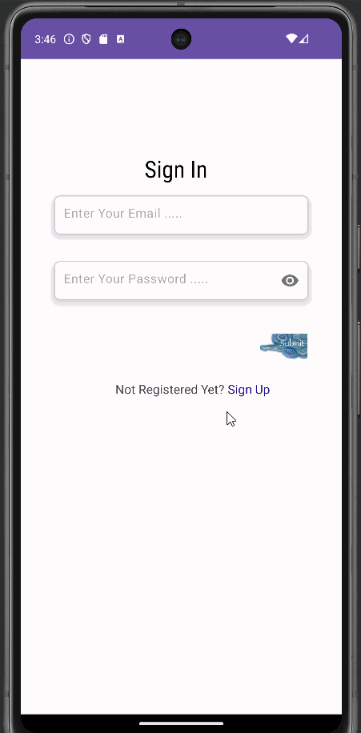

# Project 7: Updated Note-Taking App
An Android app that allows a user to sign up or log in and create notes.

## Functionality 

The following **required** functionality is completed:

* [ ] User can log in with an email and password
* [ ] User can register with an email and password
* [ ] Accounts are stored in FireBase for authentication
* [ ] User can log out to go back to the login screen
* [ ] User can add notes with a title and description
* [ ] Notes are stored in a database

The following **extensions** are implemented:

* I didn't implement any extensions for this project.

## Video Walkthrough

Here's a walkthrough of implemented user stories:

GIF created with [LiceCap](http://www.cockos.com/licecap/).

## Notes

## License

    Copyright [2023] [Billy Moore]

    Licensed under the Apache License, Version 2.0 (the "License")
    you may not use this file except in compliance with the License.
    You may obtain a copy of the License at

        http://www.apache.org/licenses/LICENSE-2.0

    Unless required by applicable law or agreed to in writing, software
    distributed under the License is distributed on an "AS IS" BASIS,
    WITHOUT WARRANTIES OR CONDITIONS OF ANY KIND, either express or implied.
    See the License for the specific language governing permissions and
    limitations under the License.
